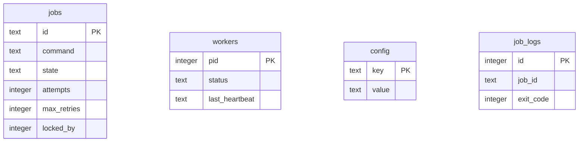

<div align="center">


<br/>

[]()
[]()
[]()

</div>

## 📖 Contents

[What is it](#-what-is-queuectl) • [Assignment Mapping](#-assignment-brief-mapped) • [Bonus Features](#-bonus-features--all-implemented) • [Architecture](#-project-architecture) • [Quick Start](#-quick-start) • [REPL](#️-repl) • [CLI Reference](#️-cli-command-reference) • [Technical Details](#️-technical-implementation) • [Assumptions](#-assumptions--trade-offs) • [Testing](#-testing) • [Demo](#-demo--submission-links) 
---

## 💡 What is QueueCTL?

A local-first, **zero-dependency** CLI job queue for Node.js — persistence via SQLite, retries via exponential backoff, and a Dead Letter Queue for permanently failed jobs. No Redis, no broker, no external server.

| Instead of... | QueueCTL uses... |
|---|---|
| Redis / RabbitMQ | **SQLite (WAL mode)** for ACID-safe local storage |
| Express/Fastify for the dashboard | Node's native `http` + `fs` modules |
| A hosted scheduler | In-process **exponential backoff** |

---

## 🎯 Assignment Brief, Mapped

Submission for the **Flam Backend Developer Internship Assignment**.

| Required | Delivered |
|---|---|
| Enqueue/manage jobs via CLI | `enqueue --id <id> --command <cmd>` |
| Job fields (`id`,`command`,`state`,`attempts`,`max_retries`,timestamps) | All present + extras (`priority`,`timeout`,`run_at`,`locked_by`) |
| Lifecycle `pending→processing→completed/failed→dead` | Enforced via `jobs.state` transitions |
| Multiple parallel workers | `worker start --count <n>` |
| Exit codes drive retry logic | Non-zero/missing command → logged + retried |
| Backoff `delay = base^attempts` | Implemented as specified |
| DLQ after `max_retries` | Auto-transition to `dead`, visible via `dlq list` |
| Persistence across restarts | SQLite WAL — allowed alternative to JSON per brief |
| No duplicate processing (locking) | `BEGIN IMMEDIATE` transactional claim |
| Graceful shutdown | Finishes active job, unlocks, exits on `SIGINT`/`SIGTERM` |
| Configurable retry/backoff, no hardcoding | Persisted in SQLite `config` table |
| Minimal testing of core flows | `tests/verify.js`, 8 E2E assertions (5 required) |

---

## 🌟 Bonus Features — All Implemented

Timeout handling ✅ · Priority queues ✅ · Scheduled jobs `--run-at` ✅ · Output logging ✅ · Metrics ✅ · Web dashboard ✅ — all six optional items from the brief.

**Evaluation weight:** Functionality 40% · Code Quality 20% · Robustness 20% · Docs 10% · Testing 10%.

---

## 📂 Project Architecture

```
queuectl/
├── bin/queuectl.js       # CLI entry point
├── cli/                  # commands.js, repl.js, ui.js
├── config/config.js      # retry/backoff controller
├── dashboard/            # server.js + public/index.html
├── database/db.js        # SQLite WAL setup & migrations
├── queue/queue.js        # enqueue, metrics, DLQ retries
├── worker/worker.js      # polling, spawns, heartbeats
├── tests/verify.js       # E2E verification suite
└── data/queuectl.db      # SQLite DB (auto-created, git-ignored)
```

---

## 🚀 Quick Start

```bash
cd queuectl && npm install
npm test                                       # E2E verification
node bin/queuectl.js dashboard --port 3000     # http://localhost:3000
```

**Usage Example (Real Captured Output):**

```bash
# 1. Enqueuing a job
$ node bin/queuectl.js enqueue --id demo-job --command "echo hello"

  📥 JOB ENQUEUED
  ──────────────────────────────────────────────────
  Job ID       demo-job
  Command      echo hello
  Max Retries  3
  Priority     0
  Timeout      None
  Scheduled    Immediate

  ✔ Job demo-job added to queue successfully.

# 2. Listing pending jobs
$ node bin/queuectl.js list --state pending

  📋 JOBS ─ PENDING
  ──────────────────────────────────────────────────
╭──────────┬──────────────┬──────────────┬─────────┬─────┬───────────╮
│ ID       │ COMMAND      │ STATE        │ RETRIES │ PRI │ SCHEDULED │
├──────────┼──────────────┼──────────────┼─────────┼─────┼───────────┤
│ demo-job │ echo hello   │ ● pending    │ 0/3     │ 0   │ now       │
╰──────────┴──────────────┴──────────────┴─────────┴─────┴───────────╯
  1 job(s) shown

# 3. Viewing the CLI System Dashboard
$ node bin/queuectl.js status

  ╭───────────────────────────────────────────────────────╮
  │ 
  │   SYSTEM DASHBOARD
  │ 
  ├───────────────────────────────────────────────────────┤
  │ 
  │   Workers Active   ⬤  0 idle
  │   Total Jobs       1
  │ 
  ├───────────────────────────────────────────────────────┤
  │   JOB BREAKDOWN
  ├───────────────────────────────────────────────────────┤
  │ 
  │   ● Pending        ███████████████ 1/1
  │   ◉ Processing     ░░░░░░░░░░░░░░░ 0/1
  │   ✔ Completed      ░░░░░░░░░░░░░░░ 0/1
  │   ⚠ Failed         ░░░░░░░░░░░░░░░ 0/1
  │   ✖ Dead (DLQ)     ░░░░░░░░░░░░░░░ 0/1
  │ 
  ╰───────────────────────────────────────────────────────╯
```

---

## 🖥️ REPL

```bash
node bin/queuectl.js
```
Launches an interactive shell with arrow-key history and Tab autocompletion — `help` to list commands, `exit` to quit.

---

## 🛠️ CLI Command Reference

| Group | Command | Description |
|---|---|---|
| Queue | `enqueue --id --command [--priority] [--timeout] [--retries] [--run-at]` | Add a job |
| | `list --state <state>` | List jobs by state |
| | `status` | Queue/worker summary |
| Workers | `worker start --count <n> [--drain]` | Spawn workers |
| | `worker stop` | Graceful shutdown |
| DLQ | `dlq list` / `dlq retry <id>` | View / resurrect dead jobs |
| Monitor | `dashboard --port <n>` | Web dashboard |
| | `metrics` | Success rate, durations |
| | `logs <id>` | stdout/stderr/exit codes |
| Config | `config list` / `config set <key> <val>` | Manage `max-retries`, `backoff-base` |

---

## 🏗️ Technical Implementation



- **Locking:** worker opens `BEGIN IMMEDIATE`, claims oldest ready `pending` job, sets `state=processing`+`locked_by=<pid>`, commits — other workers see it and skip.
- **Self-healing:** heartbeats every 3s; silent >10s → `process.kill(pid, 0)` liveness check → dead worker's jobs reset to `pending`.
- **Graceful shutdown:** stop polling → finish active job → unlock → exit.
- **Persistent config:** `max-retries`/`backoff-base` live in SQLite, not code.

---

## 🧠 Assumptions & Trade-offs

1. **SQLite over JSON** — avoids partial writes/corruption under concurrent workers; WAL gives ACID + OS-level locking.
2. **Single-node only** — `process.kill(pid, 0)` liveness assumes one machine; multi-node needs a shared coordinator (out of scope).
3. **Invalid commands** — caught by the spawner, logged with non-zero exit, retried with backoff instead of crashing the worker.

---

## 🧪 Testing

```bash
npm test
```

| # | Scenario |
|---|---|
| 1 | Basic job success |
| 2 | Invalid command fails gracefully |
| 3 | Timeout enforcement |
| 4 | Exponential backoff timing |
| 5 | DLQ transition at max retries |
| 6 | DLQ `retry` resurrection |
| 7 | Graceful shutdown → jobs return to `pending` |
| 8 | Metrics calculation |

* **Job persistence across restarts:** Guaranteed by persistent SQLite WAL-mode database storage (`data/queuectl.db`). Jobs survive worker process crashes and system restarts automatically.

---

## 📹 Demo & Submission Links

*   🎥 **Recorded CLI Demo:** [Google Drive Link](#) — *replace with your real video link before submitting.*
*   💻 **GitHub Repository:** [QueueCTL Repository](#) — https://github.com/bhumika-mishra-26/QueueCTL

---

## 🚧 Security & Trust Boundaries

* **Command Sandboxing (Arbitrary Shell Commands)**: As mandated by the assignment guidelines, workers execute arbitrary commands using Node's `child_process.spawn`. This executes unsandboxed shell tasks under the system user privileges of the running worker. Only trusted inputs and commands should be enqueued to prevent arbitrary code execution vulnerabilities.


<div align="center">

</div>
