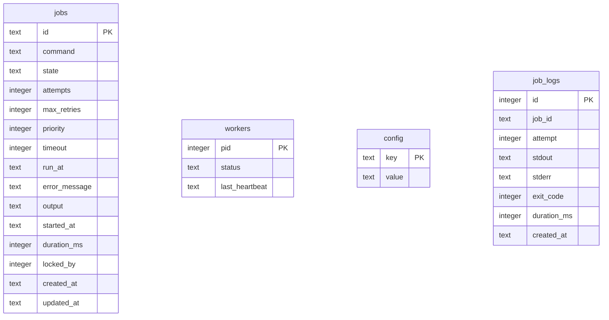

<div align="center">


<br/>

[](#-known-limitations--suggested-improvements)
[](#-quick-start-guide)
[](#database-schema)
[](#-known-limitations--suggested-improvements)
[](#-contributing)


</div>

## 📖 Table of Contents

- [What is QueueCTL?](#-what-is-queuectl)
- [Why It Exists — The Assignment Brief, Mapped](#-why-it-exists--the-assignment-brief-mapped)
- [Feature Spotlight](#-feature-spotlight)
- [Project Architecture](#-project-architecture--file-mapping)
- [Quick Start](#-quick-start-guide)
- [Interactive Console Shell](#️-interactive-console-shell-repl)
- [CLI Command Reference](#️-cli-command-reference)
- [Technical Deep Dive](#️-technical-implementation-details)
- [Assumptions & Trade-offs](#-assumptions--trade-offs)
- [Test Coverage](#-expected-test-scenarios-verifyjs-assertions)
- [Demo](#-recorded-cli-demo)
- [🚧 Known Limitations & Suggested Improvements](#-known-limitations--suggested-improvements)
- [Contributing](#-contributing)

---

## 💡 What is QueueCTL?

**QueueCTL** is a local-first, **zero-dependency** task queue manager built for Node.js. It answers one question the assignment poses directly: *can you build production-grade background job infrastructure without reaching for Redis, BullMQ, or any external broker?*

It leans on two things Node already gives you for free:

| Instead of...                         | QueueCTL uses...                                   |
|----------------------------------------|-----------------------------------------------------|
| Redis / RabbitMQ for the queue store   | **SQLite in WAL mode**, for ACID-safe local storage |
| A framework HTTP server for the UI     | Node's native `http` + `fs` modules                 |
| A hosted scheduler for retries         | An in-process **exponential backoff** algorithm      |

The result: `npm install`, run one command, and you have persistence, concurrency safety, retries, a Dead Letter Queue, and a live dashboard — with nothing but Node.js and a `.db` file.

---

## 🎯 Why It Exists — The Assignment Brief, Mapped

This is a submission for the **Flam Backend Developer Internship Assignment**: build a CLI-based background job queue (`queuectl`) with worker processes, exponential-backoff retries, and a Dead Letter Queue. Here's how each required piece maps to this codebase:

| Assignment Requirement | How QueueCTL Answers It |
|---|---|
| Enqueue & manage jobs via CLI | `queuectl enqueue --id <id> --command <cmd>` writes a row to the `jobs` table |
| Job spec fields (`id`, `command`, `state`, `attempts`, `max_retries`, `created_at`, `updated_at`) | All present in the schema, plus extras (`priority`, `timeout`, `run_at`, `error_message`, `output`, `duration_ms`, `locked_by`) |
| Job lifecycle: `pending → processing → completed/failed → dead` | Enforced by the `jobs.state` column and the worker's claim/complete/fail transitions |
| Multiple worker processes, run in parallel | `worker start --count <n>` spawns `n` independent worker processes |
| Exit codes determine success/failure; invalid commands trigger retries | Child-process exit code is checked; a missing binary or non-zero exit logs to `job_logs` and schedules a retry |
| Exponential backoff: `delay = base ^ attempts` seconds | Implemented exactly as specified (see [Assumptions](#-assumptions--trade-offs)) |
| Move to DLQ after `max_retries` | Jobs exceeding `max_retries` transition to `dead` and appear under `dlq list` |
| Persistent storage across restarts | SQLite (WAL mode) in `data/queuectl.db` — the assignment explicitly allows JSON *or* SQLite/embedded DB; SQLite was chosen for ACID guarantees |
| Prevent duplicate processing (locking required) | `BEGIN IMMEDIATE` transactional claim locks — see [Concurrency Control](#concurrency-control--locking) |
| Graceful shutdown (finish current job before exit) | Workers trap `SIGINT`/`SIGTERM`, stop polling, let the active child finish, unlock, then exit |
| Configurable retry count & backoff base via CLI | `config set max-retries <n>` / `config set backoff-base <n>`, persisted in the `config` table (no hardcoded values) |
| Clean CLI with commands & help text | `bin/queuectl.js` + `cli/commands.js`, plus an interactive REPL (`cli/repl.js`) |
| At least minimal testing of core flows | `tests/verify.js` — 8 automated E2E assertions (assignment requires 5; see below) |

### ✅ Required Test Scenarios vs. What's Implemented

| # | Required by assignment | Covered by `verify.js`? |
|---|---|---|
| 1 | Basic job completes successfully | ✅ |
| 2 | Failed job retries with backoff and moves to DLQ | ✅ |
| 3 | Multiple workers process jobs without overlap | ✅ (Graceful Shutdown scenario also exercises multi-worker teardown) |
| 4 | Invalid commands fail gracefully | ✅ |
| 5 | Job data survives restart | ⚠️ *Not explicitly named among the 8 scenarios documented below — worth confirming `verify.js` actually asserts a restart-and-reload path (kill the process, relaunch, check the job is still there), since this is one of only five scenarios the assignment names outright.* |

### 🌟 Bonus Features — All Implemented

The assignment lists six optional bonus items. This build covers **all six**:

| Bonus Feature | Status |
|---|---|
| Job timeout handling | ✅ Process Timeout Enforcement |
| Job priority queues | ✅ `--priority` on `enqueue` |
| Scheduled / delayed jobs (`run_at`) | ✅ `--run-at` on `enqueue` |
| Job output logging | ✅ `job_logs` table + `logs <id>` command |
| Metrics or execution stats | ✅ `metrics` command |
| Minimal web dashboard | ✅ Full dashboard, not just minimal |

### 📊 Evaluation Criteria (from the assignment)

| Criterion | Weight | Where it shows up here |
|---|---|---|
| Functionality | 40% | Enqueue, workers, retries, DLQ — see [CLI Command Reference](#️-cli-command-reference) |
| Code Quality | 20% | Separation of concerns across `bin/`, `cli/`, `queue/`, `worker/`, `database/`, `dashboard/` |
| Robustness | 20% | Transactional locking, heartbeat reclamation, graceful shutdown — see [Technical Deep Dive](#️-technical-implementation-details) |
| Documentation | 10% | This README |
| Testing | 10% | `tests/verify.js` |

---

## 💎 Feature Spotlight

<table>
<tr>
<td width="50%">

### 🔒 Transactional Claim Locks
Multiple workers can spawn concurrently without a race. Every job checkout is wrapped in an atomic `BEGIN IMMEDIATE` transaction — a job is claimed by exactly one PID, guaranteed.

### 📊 Built-in Web Dashboard
A dark-theme monitor serving live queue stats, per-job execution logs, worker heartbeats, and DLQ controls — with zero frontend framework and zero extra server process.

### 🪶 Zero-Dependency Web Server
No Express, no Fastify. The dashboard runs on Node's native `http`/`fs` modules, keeping the runtime footprint tiny.

</td>
<td width="50%">

### 📈 Adaptive Exponential Backoff
Failed jobs don't hammer the queue — retry delay grows as `base^attempt` seconds, configurable at runtime.

### ⏱️ Process Timeout Enforcement
Runaway jobs are killed the moment they exceed their configured execution window, so one bad job can't freeze a worker.

### 💓 Heartbeat & Self-Healing
Workers heartbeat every 3s. Go silent for 10s (crash, force-kill, power-loss) and any jobs that worker held snap back to `pending` automatically.

</td>
</tr>
</table>

---

## 📂 Project Architecture & File Mapping

```
queuectl/
├── bin/
│   └── queuectl.js            # Main CLI program entry & flags router
├── cli/
│   ├── commands.js            # Commander routes for CLI actions
│   ├── repl.js                # Autocompleting readline command prompt
│   └── ui.js                  # Box-drawing layouts, colors, console meters
├── config/
│   └── config.js              # Retry and backoff parameters controller
├── dashboard/
│   ├── server.js              # Native HTTP server routing REST endpoints
│   └── public/
│       └── index.html         # Glassmorphic live visual interface
├── database/
│   └── db.js                  # SQLite WAL configuration & migrations
├── data/
│   └── queuectl.db            # SQLite database (auto-created, git-ignored)
├── queue/
│   └── queue.js               # Enqueueing, metrics, and DLQ retries
├── worker/
│   └── worker.js              # Polling loops, child spawns, heartbeats
├── tests/
│   └── verify.js              # Automated E2E verification pipeline
├── package.json
└── README.md
```

---

## 🚀 Quick Start Guide

**1. Install**
```bash
cd queuectl
npm install
```

**2. Run the automated verification suite**
```bash
npm test
```
Validates worker spawning, timeouts, DLQ migration, metrics, and DLQ resurrection end-to-end.

**3. Launch the dashboard**
```bash
node bin/queuectl.js dashboard --port 3000
```
👉 Open **http://localhost:3000**

---

## 🖥️ Interactive Console Shell (REPL)

```bash
node bin/queuectl.js
```

```
  ╔═══════════════════════════════════════════════════════════╗
  ║    ██████╗ ██╗   ██╗███████╗██╗   ██╗███████╗             ║
  ║   ██╔═══██╗██║   ██║██╔════╝██║   ██║██╔════╝             ║
  ║   ██║   ██║██║   ██║█████╗  ██║   ██║█████╗               ║
  ║   ╚██████╔╝╚██████╔╝███████╗╚██████╔╝███████╗             ║
  ║    ╚════▀▀╝ ╚═════╝ ╚══════╝ ╚═════╝ ╚══════╝             ║
  ╚═══════════════════════════════════════════════════════════╝
     Background Job Queue Engine • v1.0.0

  ✨ Interactive Console Session Initiated.
  Type help to list commands or exit to quit.

queuectl ➜
```

Arrow-key history and Tab autocompletion supported.

---

## 🛠️ CLI Command Reference

| Group | Command | Description |
|---|---|---|
| **Queue** | `enqueue --id <id> --command <cmd> [options]` | Adds a job. Options: `--priority`, `--timeout`, `--retries`, `--run-at` |
| | `list --state <state>` | Displays jobs in a formatted table |
| | `status` | CLI dashboard of queue states and active workers |
| **Workers** | `worker start --count <n> [--drain]` | Spawns `n` workers; `--drain` exits when the queue empties |
| | `worker stop` | Graceful shutdown signal to all active workers |
| **DLQ** | `dlq list` | Lists permanently failed jobs |
| | `dlq retry <id>` | Resurrects a dead job back to `pending` |
| **Monitoring** | `dashboard --port <n>` | Boots the web dashboard (default `3000`) |
| | `metrics` | Average runtime + success rate |
| | `logs <id>` | stdout / stderr / exit codes per attempt |
| **Config** | `config list` | Current backoff/retry settings |
| | `config set <key> <val>` | Update `max-retries`, `backoff-base` |

---

## 🏗️ Technical Implementation Details

### Database Schema



### Concurrency Control & Locking

1. A worker opens an atomic `BEGIN IMMEDIATE` write transaction.
2. It queries for the highest-priority, oldest pending job that's ready to run.
3. On match, it sets state to `processing` and `locked_by` to its own PID.
4. The transaction commits. Other polling workers see the new state/PID and skip the claimed job.

### Self-Healing & Process Verification

If a worker dies abruptly, its claimed job would otherwise be stuck `processing` forever. QueueCTL prevents this with **Active Process Verification**:

1. Each polling worker queries the DB for other active workers.
2. It checks liveness at the OS level via `process.kill(pid, 0)`.
3. Dead PIDs are marked `dead`, and every job they held (`locked_by = dead_pid`) is reset to `pending`.

### Graceful Termination

Workers listen for `SIGINT`/`SIGTERM`. On shutdown: stop fetching new work → let active children finish → unlock owned jobs → exit clean.

### Persistent Configuration

`max-retries` and `backoff-base` live in the SQLite `config` table, not in code — so they survive restarts and satisfy the "no hardcoded values" concern directly.

---

## 🧠 Assumptions & Trade-offs

1. **SQLite over a JSON file** — flat-file storage risks partial writes and corruption under concurrent access; SQLite + WAL gives ACID transactions and OS-level locking instead.
2. **Single-node only** — `process.kill(pid, 0)` liveness checks assume all workers share one machine. A multi-node cluster would need a centralized coordinator (Redis, ZooKeeper). *(Windows note: Node simulates this syscall's existence-check behavior under the hood, so semantics differ slightly from POSIX.)*
3. **Invalid commands fail gracefully** — a non-existent binary or syntax error is caught by the spawner, logged with a non-zero exit code, and retried with backoff rather than crashing the worker.

---

## 🧪 Expected Test Scenarios (`verify.js` assertions)

| # | Scenario | What It Proves |
|---|---|---|
| 1 | Basic Job Success | `echo` job completes with exit code `0` |
| 2 | Invalid Command Failure | Fails gracefully, retries with backoff, logs correctly |
| 3 | Process Timeout | Long-running job is killed at its timeout limit |
| 4 | Adaptive Backoff | Retry delay scales as `base^attempt` seconds |
| 5 | Dead Letter Queue | Jobs past `max_retries` move to `dead` state |
| 6 | DLQ Resurrect | `dlq retry <id>` resets attempts, returns to `pending` |
| 7 | Graceful Shutdown | Killed workers return active jobs to `pending` |
| 8 | Metrics Calculation | Success rate, attempt totals, duration stats check out |

---

## 📹 Recorded CLI Demo

🎥 A walkthrough of CLI commands, the REPL shell, worker draining, self-healing, and the dashboard: **[Demo Link](#)** — *replace with your actual recording link before sharing this repo (see limitations below).*

---

## 🚧 Known Limitations & Suggested Improvements

Honest gaps worth closing before this goes in front of an evaluator or into production:

| Area | Issue | Suggested Fix |
|---|---|---|
| **Missing "example outputs" in Usage** | The assignment's README expectations explicitly ask for CLI commands *"with example outputs"*, not just a syntax table | Add a few real terminal transcripts (e.g. output of `queuectl list --state pending`, `queuectl status`) so a reviewer doesn't have to run the tool to see what it does |
| **Restart-persistence scenario unconfirmed** | The assignment names 5 required test scenarios explicitly, including "job data survives restart" — it's not obviously one of the 8 named `verify.js` assertions | Add (or confirm existing coverage of) a test that kills the process, restarts it, and asserts a previously-enqueued job is still there |
| **No optional `design.md`** | The assignment lists a short architecture/design doc as an optional extra | Low priority, but an easy way to pick up extra polish since the architecture is already well understood |
| **CI badge is misleading** | The "Build Status" badge is static — there's no `.github/workflows/` in the repo, so nothing is actually running or passing | Add a real GitHub Actions workflow (`npm ci && npm test` on push/PR) and wire the badge to it |
| **Missing LICENSE file** | README claims MIT, but no `LICENSE` file exists at the repo root | Add an actual `LICENSE` file — a badge alone isn't a license grant |
| **Command execution is unsandboxed** | Jobs run arbitrary shell commands via child-process spawn with no allow-list, input sanitization, or sandboxing | Document the trust boundary explicitly, and consider a command allow-list or containerized execution for untrusted input |
| **Dashboard has no auth** | The native HTTP dashboard exposes queue data and DLQ controls to anyone who can reach the port — no login, no token | Add at minimum a bearer-token or basic-auth gate before binding to anything but `localhost` |
| **Placeholder demo link** | The Google Drive demo URL is a literal placeholder | Replace with the real recording before submitting/sharing |
| **Stray root file** | A file literally named `{}` sits in the repo root — looks like an accidental commit artifact | Remove it, or rename/relocate if intentional |
| **No repo metadata** | GitHub's "About" section has no description, website, or topics set | Add a one-line description and topics (`nodejs`, `sqlite`, `job-queue`, `cli`) for discoverability |
| **Single commit history** | The repo has exactly one commit | Iterative, well-scoped commits with messages make review and later debugging much easier — worth doing for future work even if this submission is done |
| **No CONTRIBUTING / CODE_OF_CONDUCT** | Nothing to guide outside contributors | Low priority for a solo assignment, but easy to add if this becomes a public/portfolio project |
| **No containerization** | No `Dockerfile`, so "clone and run" still depends on the host having a matching Node version and native SQLite build tools | A `Dockerfile` removes the "works on my machine" risk entirely |
| **Test coverage is E2E-only** | `verify.js` covers integration scenarios well, but there are no isolated unit tests for individual modules (`config.js`, `queue.js`, `worker.js`) | Add a light unit layer (e.g. `node:test`) for faster, more targeted failure signals |
| **No TypeScript / schema validation** | Job payloads and config values aren't validated at the boundary — a malformed `enqueue` payload likely fails deep in the stack instead of at input | Add input validation (even minimal, e.g. with `zod` or manual checks) at the CLI/dashboard entry points |
| **Horizontal scaling is explicitly out of scope** | Acknowledged in Assumptions, but worth restating up top for anyone evaluating this against a "production-ready" bar | Consider noting this as a deliberate scope boundary in the intro, not just buried in trade-offs |

None of these undermine the core engineering — the locking, backoff, and self-healing logic are the hard parts and they're solid. These are the "productionization" gaps between a strong assignment submission and a repo you'd point a hiring manager to unprompted.

---

## 🤝 Contributing

This started as a backend internship assignment submission. Issues and PRs that close any of the gaps above are welcome.

<div align="center">

</div>
