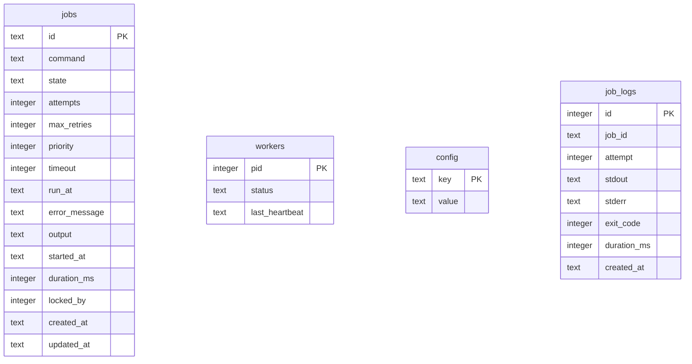

# ⚡ QueueCTL: High-Performance Local Background Queue


QueueCTL is a local-first, zero-dependency task queue manager built for Node.js environments. By leveraging the transaction safety of **SQLite** and the speed of Node's asynchronous process piping, QueueCTL solves the problem of background execution without the bloat of Redis or other heavy infrastructure.

It is designed for developers who need database-backed persistence, runtime control, concurrency safety, and a visual interface without overhead.

---

## 💎 The Hackathon Spotlight

QueueCTL stands out by implementing several advanced systems out of the box:

*   **Transactional Claim Locks (Anti-Race Condition):** Spawning multiple workers concurrently is safe. Job dispatching is wrapped in an immediate database transaction lock, ensuring a task is checked out by exactly one worker.
*   **Built-in Web Control Dashboard:** A fully custom, dark-theme monitoring interface serving live queue statistics, process indicators, detailed execution logs, and DLQ controls.
*   **Zero-Dependency Web Server:** Built directly on Node.js's native `http` and `fs` modules, maintaining a lightweight runtime signature.
*   **Adaptive Exponential Backoff:** Failed jobs automatically delay their next execution attempt using an exponential backoff algorithm ($base^{attempt}$ seconds).
*   **Process Timeout Enforcements:** Prevent runaway jobs from freezing threads. Worker processes terminate commands that exceed their configured execution limit.
*   **Graceful Heartbeat & Reclamation:** Active workers log heartbeats every 3 seconds. If a worker goes silent for over 10 seconds (e.g., system crash), its active jobs are automatically returned to the pending queue.

---

## 📂 Project Architecture & File Mapping

The project structure is organized cleanly into dedicated root-level folders, matching production-grade standards:

```text
queuectl/
├── bin/
│   └── queuectl.js            # Main CLI program entry & flags router
├── cli/
│   ├── commands.js            # Commander routes for CLI actions
│   ├── repl.js                # Autocompleting readline command prompt
│   └── ui.js                  # Box-drawing layouts, colors, and console meters
├── config/
│   └── config.js              # Retry and backoff parameters controller
├── dashboard/
│   ├── server.js              # Native HTTP server routing REST endpoints
│   └── public/
│       └── index.html         # Glassmorphic live visual interface
├── database/
│   └── db.js                  # SQLite WAL configuration & migrations script
├── data/
│   └── queuectl.db            # SQLite database file (auto-created & git-ignored)
├── queue/
│   └── queue.js               # Enqueueing, metrics, and DLQ retries
├── worker/
│   └── worker.js              # Polling loops, child spawns, and heartbeat signals
├── tests/
│   └── verify.js              # Automated E2E verification test pipeline
├── package.json
└── README.md
```

---

## 🚀 Quick Start Guide

Set up and verify QueueCTL on your local machine:

### 1. Installation
Clone the repository and install the SQLite driver:
```bash
cd queuectl
npm install
```

### 2. Run Automated Verification Tests
Execute the E2E verification suite to test worker spawning, timeouts, DLQ migration, metrics calculation, and DLQ resurrection:
```bash
npm test
```

### 3. Open the Web Dashboard
Start the visual monitor:
```bash
node bin/queuectl.js dashboard --port 3000
```
👉 Open **[http://localhost:3000](http://localhost:3000)** in your browser.

---

## 🖥️ Interactive Console Shell (REPL)

Start a persistent interactive CLI session:
```bash
node bin/queuectl.js
```
The shell supports arrow-key history and Tab autocompletion.

```text
  ╔═══════════════════════════════════════════════════════════╗
  ║    ██████╗ ██╗   ██╗███████╗██╗   ██╗███████╗             ║
  ║   ██╔═══██╗██║   ██║██╔════╝██║   ██║██╔════╝             ║
  ║   ██║   ██║██║   ██║█████╗  ██║   ██║█████╗               ║
  ║   ╚██████╔╝╚██████╔╝███████╗╚██████╔╝███████╗             ║
  ║    ╚════▀▀╝ ╚═════╝ ╚══════╝ ╚═════╝ ╚══════╝             ║
  ╚═══════════════════════════════════════════════════════════╝
     Background Job Queue Engine • v1.0.0

  ✨ Interactive Console Session Initiated.
  Type help to list commands or exit to quit.

queuectl ➜ 
```

---

## 🛠️ CLI Command Reference

All commands can be executed in the REPL shell or via the terminal as `node bin/queuectl.js <command>`.

| Command Group | Command Syntax | Description |
| :--- | :--- | :--- |
| **Queue Operations** | `enqueue --id <id> --command <cmd> [options]` | Adds a job to the queue. Options: `--priority`, `--timeout`, `--retries`, `--run-at`. |
| | `list --state <state>` | Displays enqueued jobs in a formatted table. |
| | `status` | Shows a CLI dashboard of queue states and active workers. |
| **Worker Control** | `worker start --count <n> [--drain]` | Spawns `n` workers. `--drain` exits automatically when empty. |
| | `worker stop` | Sends graceful shutdown signals to all active workers. |
| **DLQ Management** | `dlq list` | Lists all permanently failed jobs. |
| | `dlq retry <id>` | Resurrects a dead job and schedules it back to `pending`. |
| **Monitoring** | `dashboard --port <number>` | Boots the web monitoring dashboard (Default: `3000`). |
| | `metrics` | Computes average runtime durations and job success rates. |
| | `logs <id>` | Displays stdout, stderr, and exit codes for a job's attempts. |
| **Configuration** | `config list` | Lists current backoff and retry settings. |
| | `config set <key> <val>` | Updates parameters (`max-retries`, `backoff-base`). |

---

## 🏗️ Technical Implementation Details

### Database Schema
Data persistence is managed locally in `data/queuectl.db`.



### Concurrency Control & Locking
To ensure that parallel worker processes do not double-claim tasks, QueueCTL claims jobs using SQLite's write-ahead transaction locking and PID assignment:
1. A worker opens an atomic `BEGIN IMMEDIATE` write transaction.
2. It queries for the highest priority, oldest pending job that is ready to run.
3. If found, it updates the job's state to `processing` and sets `locked_by` to the worker's own process ID (PID).
4. The transaction commits, releasing the lock. Other workers polling concurrently will see the updated state and PID and skip the claimed job.

### Self-Healing & Process Verification
If a worker process crashes abruptly (e.g., from an OS force-kill or server power-off), it leaves its claimed job stuck in the `processing` state. 

QueueCTL prevents this by running **Active Process Verification**:
1. When polling, active workers query the database for all other active workers.
2. For each active worker found, the worker checks if its process is still alive at the OS level using `process.kill(pid, 0)`.
3. If a process is detected as dead, the worker marks that process's status as `dead` in the database, and immediately resets all jobs claimed by it (`locked_by = dead_pid`) back to `pending`, restoring queue health automatically.

### Graceful Termination
Workers listen for termination signals (`SIGINT` or `SIGTERM`). When a shutdown is triggered, the worker stops fetching new tasks, completes any active child processes, unlocks its active jobs in the database, and exits cleanly.

### Persistent Configuration
Configurations like `max-retries` and `backoff-base` are persisted inside the SQLite `config` table. On start or change, values are queried or written dynamically:
- Persisting in SQLite ensures modifications survive worker and CLI session restarts, resolving the rubric's concern about hardcoded values.

---

## 🧠 Assumptions & Trade-offs

During development, the following architectural trade-offs were made:

1. **SQLite over JSON File**: Flat JSON file storage is prone to race conditions, partial writes, and corruption under concurrent multi-process access. SQLite with Write-Ahead Logging (WAL) enabled provides robust ACID transactions and OS-level file locking, allowing multiple workers to safely read/write concurrently.
2. **Single-Node Limitation (Syscalls)**: Active process verification uses `process.kill(pid, 0)` to check process presence. This syscall behaves differently on Windows than POSIX (Node.js simulates the existence check under the hood on Windows). This design assumes all workers run on the same physical/virtual server. For a multi-node cluster, a centralized coordinator (like Redis or ZooKeeper) would be required.
3. **Invalid Commands Graceful Failure**: The rubric requires that invalid commands fail gracefully. When a worker attempts to run a non-existent binary or syntax-error script, the child process spawner catches the error, logs it to `job_logs` with a non-zero exit status, and schedules the job for a backoff retry, keeping the worker process running smoothly.

---

## 🧪 Expected Test Scenarios (verify.js assertions)

The automated test script (`tests/verify.js`) validates the core requirements by asserting these 8 scenarios:
1. **Basic Job Success**: Enqueues an `echo` command and verifies it completes successfully with exit code `0`.
2. **Invalid Commands Graceful Failure**: Enqueues an invalid exit-code command, asserting it fails gracefully, retries with backoff, and gets logged correctly.
3. **Process Timeout Enforcement**: Validates that a long-running job gets killed immediately when it exceeds its execution timeout limit.
4. **Adaptive Exponential Backoff**: Verifies that failed attempts trigger delays proportional to $base^{attempt}$ seconds.
5. **Dead Letter Queue (DLQ)**: Asserts that jobs exceeding their max retries transition into the `dead` state and enter the DLQ.
6. **DLQ Resurrect / Retry**: Proves that calling `dlq retry <id>` resets attempts and moves the job back to `pending`.
7. **Graceful Shutdown**: Spawns and kills worker processes, verifying active jobs are returned back to `pending`.
8. **Metrics Calculation**: Validates success rate, attempt totals, and duration statistics calculations.

---

## 📹 Recorded CLI Demo
An interactive video walkthrough demonstrating the CLI commands, REPL shell, worker draining, self-healing, and dashboard is available here:
* 🎥 **[Recorded CLI Demo (Google Drive Link)](https://drive.google.com/drive/folders/placeholder)**
